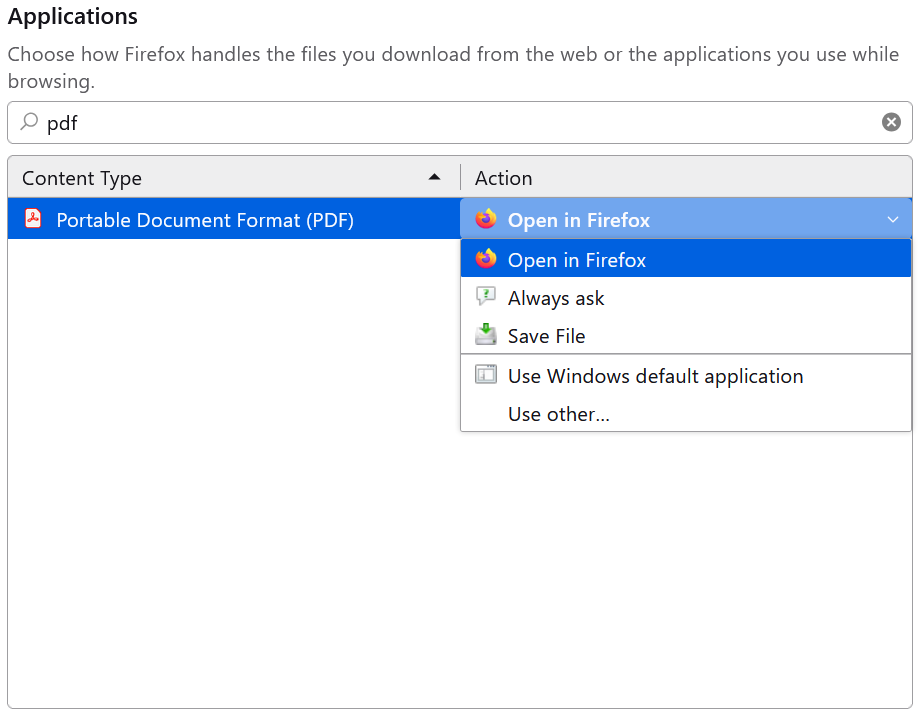

# MAFIL - Proband Safety Questionnaire
Web application for ensuring the registration and safety of MR measurements in the [MAFIL laboratory (CEITEC)](https://mafil.ceitec.cz/en/).

**&#33; This application relies on the central system of the MAFIL laboratory called MAFILDB &#33;**

## Table of contents
- [Repository structure](#repository-structure)
- [Base URL paths](#base-url-paths)
- [Installation](#installation)
  - [Populating the database with initial data](#populating-the-database-with-initial-data)
- [Services update](#services-update)
- [Local development](#local-development)
  - [Installation](#installation-1)
  - [Populating the database with initial data](#populating-the-database-with-initial-data-1)
  - [Changing the database schema and applying database migrations](#changing-the-database-schema-and-applying-database-migrations)
  - [Updating i18n translations](#updating-i18n-translations)
  - [Useful tools](#useful-tools)
- [Used MAFILDB API endpoints](#used-mafildb-api-endpoints)
- [Possible issues](#possible-issues)
  - [PDF not showing on the Visit detail page](#pdf-not-showing-on-the-visit-detail-page)

## Repository structure
This repository contains the following most important directories and files:
- *backend* - server app
  - *prisma* - Prisma schema and SQL migrations
  - *src* - source files
  - *test* - tests
  - *Dockerfile* - instructions for assembling server Docker image
- *frontend* - client app
  - *nginx* - Nginx web server configuration
  - *public* - static files
  - *src* - source files including tests
  - *Dockerfile* - instructions for assembling client Docker image
- *docs* – system documentation
- *.env.example* - example of environment-specific variables configuration
- *docker-compose.yml* - production environment Docker services configuration
- *download.sh* - script to download files for deployment
- *LICENSE* - system license
- *README.md* - this README
- *server-config.yaml.example* - example of the server service configuration
- *web-config.json.example* - example of the web service configuration

## Base URL paths
- `/` - root path directs to the proband safety questionnaire
- `/login` - this path directs to the login page
- `/adminer` - this path directs to the Adminer (database manager)

## Installation
Firstly, install Docker and docker-compose ([see the official Docker docs](https://docs.docker.com/engine/install/)) on the system you want to run this app on.

After that use the `download.sh` script (located in the project root directory) to download files essential to run the app.
- docker-compose.yml
- .env
- server-config.yaml
- web-config.json

```bash
./download.sh -d [DOWNLOAD_PATH] -e [ENV]
```

Edit downloaded files and transfer the directory to the server. You can use this command template:
```sh
scp -r -i SSH_PRIVATE_KEY_FILE_PATH LOCAL_DIR_PATH USER@SERVER:REMOTE_DIR_PATH
```

In the app root directory on the remote server create the `certs` directory and store there the SSL certificate `certificate.pem` and the corresponding private key `private_key.pem`.

Start all the services using this command:
```
docker-compose up -d
```

The command will start the services listed below:
- *postgres* - database
- *postgres-backup* - database backup service
- *adminer* - database manager
- *server* - app server
- *web* – web server

These volumes will be created in the app root directory:
- *database-storage* - database files
- *database-backups* - periodic backups of the database
- *logs*
  - *server* - app server logs
  - *web* - web server logs

### Populating the database with initial data
To populate the database with initial data (languages, genders, native languages, handednesses and safety questions), the command below must be run inside the `server` container.
```
docker-compose exec server npm run seed
```

Then users that are eligible to access the authenticated part of the app must be defined. Login to the Adminer at `/adminer` URL path and create accounts in the `Operator` table in the database.

## Services update
It may be necessary to update configurations before running the commands below:
- `docker-compose.yml`
- `.env` variables according to `.env.example`
- `server-config.yaml` variables according to `server-config.yaml.example`
- `web-config.json` variables according to `web-config.json.example`

To update services run these commands in the root directory:
```
docker-compose pull [SERVICE]
docker-compose up -d --force-recreate --no-deps [SERVICE]
docker image prune -f
```

## Local development
### Installation
In the root directory create the following files:
- `.env` configuration file inspired by the `.env.local.example`
- `server-config.yaml` configuration file inspired by the `server-config.local.yaml.example`
- `web-config.json` configuration file inspired by the `web-config.local.json.example`

Edit `.env`, `server-config.yaml` and `web-config.json` configuration variables with your values.

The docker-compose configuration file to use for the development is called `docker-compose.local.yml`.
Start all the services with the command below:
```
docker-compose -f docker-compose.local.yml up -d
```

The backend and frontend `package.json` and the source code directory are mapped as volumes in the corresponding container filesystem.

Only `node_modules` are not mapped to Docker containers due to potential platform-specific code. So they must be installed and updated separately on a local machine and in the `server` and `web` Docker containers.

To install or update Node packages run the command:
```
npm i
```
* on a local machine in the `/`, `/backend` and `/frontend` directories.
* in the `server` Docker container in the `/usr/src/app/backend` directory.
* in the `web` Docker container in the `/usr/src/app/frontend` directory.

### Populating the database with initial data
To populate the local database with initial data (languages, genders, native languages, handednesses and safety questions), the command below must be run inside the `server` container.
```
npm run seed:local
```

You also need to create the user you specified in the `web-config.json` in the database.

### Changing the database schema and applying database migrations
`postgres` and `server` services must be up and running to apply changes from the `schema.prisma` file.

Go into the `server` container terminal and in the `/usr/src/app/backend` directory run:
```
npx prisma migrate dev --name what-has-changed
```

This command creates a new migration and also generates a new Prisma client code that corresponds to the current state of the `schema.prisma`.

The new Prisma client code is generated only in the `server` container because local and `server` container `node_modules` are separated. To update local node_modules use this command in the `backend` directory to apply new migrations:
```
npx prisma generate
```

### Updating i18n translations
After you change the `/public/locales` translations structure, you need to run the `npm run i18n:generate` script to get the required TypeScript support for the i18n translation keys. For example in functions like `useTranslation()`, `t()` etc.

### Useful tools
* GraphQL playground to test the server GraphQL API: use `server` URL with the path `/graphql`

## Used MAFILDB API endpoints
This section describes used MAFILDB API endpoints, and whether they are used in the unauthenticated or authenticated part of this application and in what situations.

- `GET /languages`
  - unauthenticated
    - proband form
  - authenticated
    - phantom form
- `GET /languages/{code}`
  - authenticated
    - waiting room forms table
    - approval room forms table
    - duplication form
- `GET /projects`
  - authenticated
    - waiting room form
    - approval room form
    - phantom form
    - duplication form
- `GET /projects/{uuid}`
  - authenticated
    - approval room forms table
- `GET /devices?type=MR`
  - authenticated
    - waiting room form
    - approval room form
    - phantom form
    - duplication form
- `GET /devices/{id}?type=MR`
  - authenticated
    - recent visits table
- `POST /subjects`
  - authenticated
    - waiting room form - submission
    - approval room form - submission
    - phantom form - submission
    - duplication form - submission
- `POST /visits`
  - authenticated
    - waiting room form - submission
    - approval room form - submission
    - phantom form - submission
    - duplication form - submission
- `POST /visits/{uuid}/files`
  - authenticated
    - waiting room form - add PDF to the submitted visit
    - approval room form - add PDF to the submitted visit
    - phantom form - add PDF to the submitted visit
    - duplication form - add PDF to the submitted visit
- `GET /visits?newer_than=conf_max_days_old_in_sec`
  - authenticated
    - recent visits table
- `GET /visits/{uuid}`
  - authenticated
    - duplication form
    - visit detail
- `GET /visits/{uuid}/files?file_type=reg_form`
  - authenticated
    - visit detail
- `PATCH visits/{uuid}`
  - authenticated
    - visit detail - updating visit signature state

## Possible issues
In this section, you can find solutions to some problems that are not directly related to the application itself.

### PDF not showing on the Visit detail page
PDF may not be shown on the `Visit detail` page. A possible solution is to set browser settings accordingly - open the PDF directly in your browser.

For example in Firefox, you have to set it like this:


